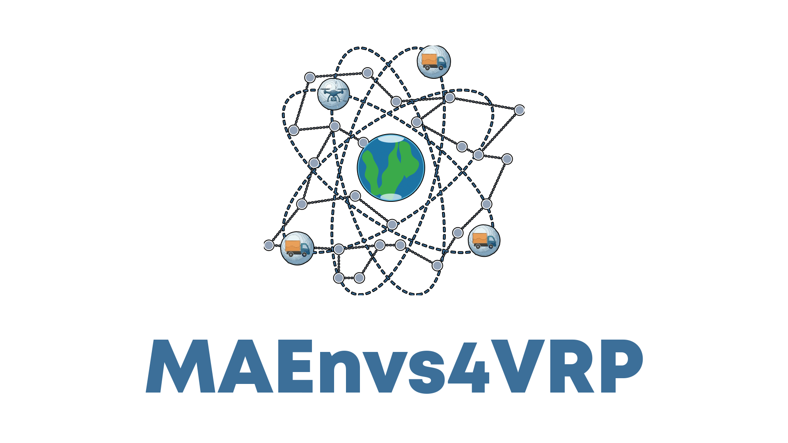

  

MAEnvs4VRP is an open research community exploring the intersection of Machine Learning and combinatorial logistics. We develop environments, algorithms, and benchmarks that leverage Neural Combinatorial Optimization to solve Vehicle Routing Problems (VRPs).

## Contributing

We welcome contributions from researchers, students, and practitioners interested in routing, logistics, reinforcement learning, and optimization.
